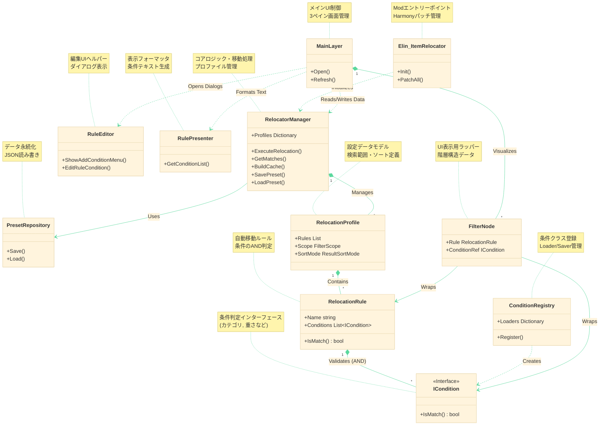

# Elin_ItemRelocator Class Overview

## クラスの役割と修正ガイド

### Elin_ItemRelocator (Mod.cs)
*   **役割**: Modのエントリーポイント。
*   **責任**: Harmonyパッチの適用、ログ出力の管理、ゲームロード時やインベントリ更新時のフック処理（ボタン追加など）。
*   **修正が必要な時**:
    *   新しいHarmonyパッチを追加したい場合。
    *   ゲーム内の別の画面（例: 住民管理画面）にもボタンを追加したい場合。
    *   Modの初期化タイミングを変更したい場合。

### RelocatorManager (Manager.cs)
*   **役割**: コアロジックを管理するシングルトン。
*   **責任**: コンテナごとのプロファイル管理、アイテム検索とキャッシュ構築、移動処理の実行、プリセット操作の統括。
*   **修正が必要な時**:
    *   アイテムの移動ロジック（`ExecuteRelocation`）を変更したい場合。
    *   パフォーマンス改善のためにキャッシュの仕組み（`BuildCache`）を見直す場合。
    *   プリセットの保存・読み込みの全体的なフローを変更したい場合。

### MainLayer (MainLayer.cs)
*   **役割**: メイン設定ウィンドウのUIコントローラー。
*   **責任**: 3ペイン構成（サイドバー、ルール設定、プレビュー）の描画、アコーディオンUIの構築、ユーザー操作のハンドリング。
*   **修正が必要な時**:
    *   設定ウィンドウのレイアウト（3ペインの配置やサイズ）を変更したい場合。
    *   サイドバーのメニュー項目や右クリック時の挙動を変更したい場合。
    *   フッターボタン（設定、実行など）を追加・削除したい場合。

### RelocationProfile (Profile.cs)
*   **役割**: 設定データモデル（コンテナ単位）。
*   **責任**: 複数のルール（`RelocationRule`）リスト、検索範囲（インベントリ/マップ）、ソートモードの設定を保持。
*   **修正が必要な時**:
    *   セーブデータに新しい設定項目（例: 「自動実行を有効にする」フラグ）を追加したい場合。
    *   ルールの保存構造を変更したい場合。

### RelocationRule (Profile.cs)
*   **役割**: 個別の自動移動ルール。
*   **責任**: 複数の条件（`ICondition`）を保持し、それらすべてに一致するか（ANDロジック）を判定。
*   **修正が必要な時**:
    *   条件の判定ロジックを AND だけでなく 複雑な条件式（AND/OR混合）に対応させたい場合。
    *   ルール自体に属性（例: 「このルールは一時停止中」）を追加したい場合。

### ICondition / BaseCondition (Conditions.cs)
*   **役割**: フィルタリング条件の定義。
*   **責任**: アイテムが条件に合致するか判定する（例: カテゴリ、DNA、重さ）。ポリモーフィズムにより拡張可能。
*   **修正が必要な時**:
    *   全く新しい種類の条件（例: 「腐りかけのアイテム」）を追加したい場合。
    *   既存の条件判定ロジック（例: 重さ判定の計算式）を修正する場合。
    *   *実例*: `ConditionFoodElement` は `ICondition` を継承し、`IsAndMode` プロパティを追加してAND/ORモード切替に対応しています。


### ConditionRegistry (Conditions.cs)
*   **役割**: 条件クラスの登録簿。
*   **責任**: JSONのキーと条件クラスの対応付け、保存・読み込みロジックの提供。
*   **修正が必要な時**:
    *   新しい `ICondition` クラスを作成し、それをJSONファイルとして保存・読み込みできるように登録する場合。
    *   レガシーなデータ形式の互換性維持のためのコードを追加する場合。

### PresetRepository (PresetRepository.cs)
*   **役割**: データ永続化層。
*   **責任**: プリセットファイル（JSON）のファイルシステムへの読み書き。
*   **修正が必要な時**:
    *   プリセットの保存場所フォルダを変更したい場合。
    *   ファイル名の命名規則を変更したい場合。

### RuleEditor (UI/RuleEditor.cs)
*   **役割**: 条件編集UIヘルパー。
*   **責任**: 条件追加・編集時のダイアログ表示や入力処理。
*   **修正が必要な時**:
    *   新しい条件を追加するためのメニュー項目を「条件追加」ボタンに追加する場合。
    *   既存の条件（例: エンチャント条件）を編集する際のダイアログUIを変更する場合。

### RulePresenter (UI/RulePresenter.cs)
*   **役割**: UI表示用フォーマッタ。
*   **責任**: ルールや条件の内容を、人間が読みやすいテキスト形式に変換。
*   **修正が必要な時**:
    *   条件リストに表示されるテキスト形式（例: "重さ >= 10"）を変更したい場合。
    *   新しい条件タイプのための表示ロジックを追加する場合。
    *   *実例*: `ShowFoodElementPicker` を呼び出して動的な食事効果リストを表示するロジックはここで管理されるべきですが、現状は `RuleEditor` 等に分散している可能性があります。


### FilterNode (UI/FilterNode.cs)
*   **役割**: UI表示用データラッパー。
*   **責任**: アコーディオンUIでルールや条件を表示するための階層構造データの保持。
*   **修正が必要な時**:
    *   UIの階層構造を変更し、条件の下にさらに詳細情報を表示したい場合など（基本的にはあまり修正しません）。

### Lang (Lang.cs)
*   **役割**: ローカライズ管理。
*   **責任**: 日本語と英語のテキストリソースの管理。
*   **修正が必要な時**:
    *   新しいUIテキストやメッセージを追加する場合。
    *   既存の翻訳を修正する場合。

## プロファイル保存形式の互換性維持ガイド

### 破壊的変更を避けるための注意点

既存のユーザープロファイル（JSONファイル）が読み込めなくなる「破壊的変更」を避けるため、以下の点に注意してください。

1.  **JSONキーの不変性**:
    *   クラスのプロパティ名を変更しても、JSON上のキーは維持してください（`[JsonProperty("old_name")]` 属性を使用するなど）。
    *   `ConditionRegistry` で登録したキー文字列（例: `"CategoryIds"`）を変更しないでください。変更すると、その条件は読み込まれず消失します。

2.  **型変換の安全性**:
    *   `int` から `string` への変更など、型の互換性がない変更は避けてください。
    *   どうしても必要な場合は、新しいプロパティを作成し、古いプロパティは `[Obsolete]` として残すか、カスタムコンバーターで吸収します。

3.  **Enumの順序維持**:
    *   `FilterScope` や `ResultSortMode` などの Enum は、デフォルトで整数値としてシリアライズされることがあります（設定によりますが）。
    *   要素の順序を変えたり、間に挿入したりすると、既存のセーブデータの値がずれて別の意味になります。新しい要素は必ず**末尾**に追加してください。

4.  **Null許容性のハンドリング**:
    *   新しく追加したフィールドは、旧データには存在しません（Nullまたはデフォルト値になります）。
    *   コード側で `null` チェックを行うか、コンストラクタで適切なデフォルト値を設定してください。

### 破壊的変更が必要な場合の対応（マイグレーション戦略）

大規模なリファクタリングなどで構造変更が避けらない場合は、以下の戦略で古いデータからの復旧・変換をサポートしてください。

1.  **フォールバック読み込みの実装**:
    *   `RelocationRuleConverter.ReadJson` のように、読み込み時にデータの構造をチェックします。
    *   「新しい形式（リスト構造）ならそのまま読む」「古い形式（フラット構造）なら変換して読む」という分岐を入れます。
    *   *実例*: `Profile.cs` の `ParseLegacyRootFields` メソッドは、古いJSON構造を新しい `Conditions` リストへ動的に変換しています。

2.  **バージョン管理**:
    *   プロファイルに `Version` フィールドを持たせます（現在は未実装ですが、必要になれば）。
    *   読み込み時にバージョンを確認し、`Version < 2` なら `MigrateV1ToV2()` を実行する、といった段階的なアップグレードパスを用意します。

3.  **Conditionローダーの堅牢化**:
    *   `ConditionRegistry` のローダー関数内で、`jo["Key"]` の存在チェックや `IsJNull` チェックを厳密に行います。
    *   想定外のデータが来てもクラッシュせず、可能な限りデフォルト値で復元するか、その条件だけをスキップして（警告ログを出しつつ）全体のロードを続行できるようにします。

### バージョン管理とマイグレーションの実装ガイド

1.  **バージョンの定義**:
    *   `Profile.cs` の `RelocationProfile.Version` が現在のデータバージョンを表します。
    *   `Manager.cs` の `CurrentProfileVersion` 定数が、Modとしての最新バージョンです。
    *   構造変更（破壊的変更）を行う際は、`CurrentProfileVersion` を +1 してください。

2.  **マイグレーションロジックの登録**:
    *   `PresetRepository.cs` のコンストラクタ内にある `_migrations` ディクショナリに、移行ロジックを登録します。
    *   `{ 現在のバージョン, 移行アクション }` の形式で登録します。
        ```csharp
        _migrations = new() {
            { 0, Migrate_0_to_1 },
            { 1, Migrate_1_to_2 } // バージョン2へ上げた際に追加
        };
        ```

3.  **移行アクションの実装**:
    *   `Migrate_X_to_Y(RelocationProfile p)` メソッドを実装し、**そのバージョン間での差分のみ**を解消するコードを書きます。
    *   複数のバージョンを跨ぐ場合も、登録された正規ルートに従って順次実行されるため、過去のすべての移行ロジックを一つのメソッドに詰め込む必要はありません。
    *   移行に失敗した場合（必須データが欠損しているなど）は、例外 (`Exception`) をスローしてください。自動的にエラーダイアログが表示され、移行処理は中断されます（ファイルの上書きも防止されます）。

## クラス図 (Mermaid)

