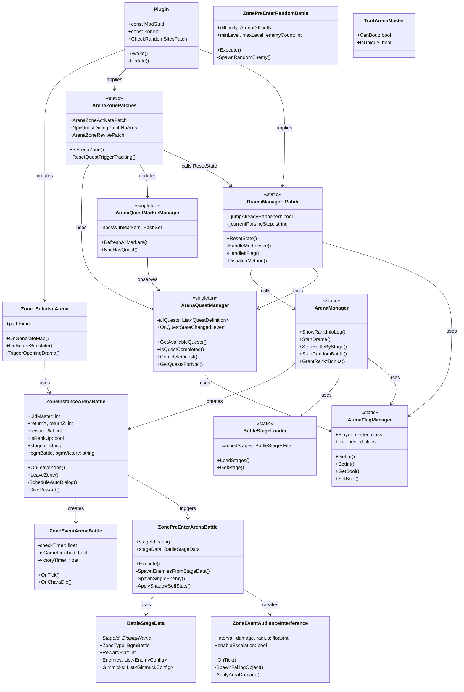
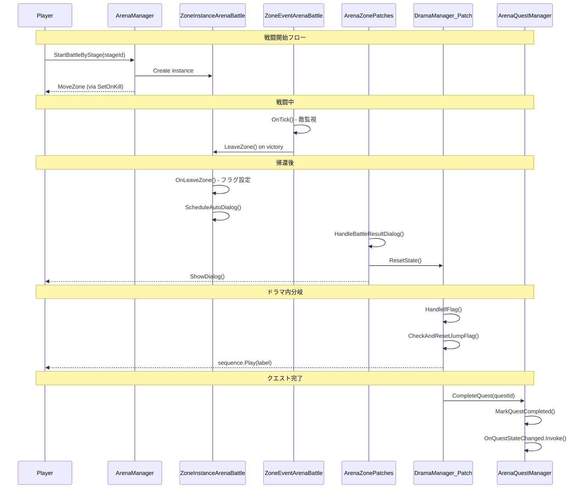

# Elin_SukutsuArena C# アーキテクチャ

このドキュメントは、Sukutsu Arena ModのC#コードベースの構造と、各クラスの役割を説明します。

---

## 1. クラス図



---

## 2. クラス役割詳細

### 2.1 エントリーポイント

#### `Plugin` (BepInEx Plugin)
- **役割**: Modのエントリーポイント。Harmonyパッチの適用とデバッグキーの処理
- **主な機能**:
  - `Awake()`: Harmonyパッチの適用
  - `Update()`: F6-F11のデバッグキー処理
  - `CheckRandomSitesPatch`: ワールド生成時にアリーナゾーンを自動生成

---

### 2.2 ゾーン関連

#### `Zone_SukutsuArena`
- **役割**: アリーナの常設ゾーン（ロビー）
- **継承**: `Zone_Civilized`
- **主な機能**:
  - カスタムマップの読み込み（`pathExport`）
  - 初回訪問時のオープニングドラマ発動

#### `ZoneInstanceArenaBattle`
- **役割**: 戦闘用の一時ゾーンインスタンス
- **継承**: `ZoneInstance`
- **主な機能**:
  - 戦闘終了時のプレイヤー帰還処理
  - 報酬付与とフラグ設定
  - 自動会話の予約（`sukutsu_auto_dialog`フラグ）

#### `TraitArenaMaster`
- **役割**: アリーナマスターNPC用のTrait
- **継承**: `TraitChara`
- **備考**: `CanBout = true`を設定することで、バニラの戦闘メニューパターンを利用

---

### 2.3 ゾーンイベント

#### `ZoneEventArenaBattle`
- **役割**: 戦闘進行の監視と終了判定
- **継承**: `ZoneEvent`
- **主な機能**:
  - `OnTick()`: 敵全滅の監視、勝利時のゾーン帰還
  - `OnCharaDie()`: プレイヤー死亡時の敗北処理と強制復活

#### `ZoneEventAudienceInterference`
- **役割**: 観客妨害ギミック（落下物）
- **継承**: `ZoneEvent`
- **主な機能**:
  - 定期的な落下物発生
  - 時間経過によるエスカレーション（頻度増加、範囲拡大）
  - 範囲ダメージとアイテムドロップ

---

### 2.4 Pre-enterイベント

#### `ZonePreEnterArenaBattle`
- **役割**: ステージ戦闘の敵配置
- **継承**: `ZonePreEnterEvent`
- **主な機能**:
  - JSONからのステージ設定読み込み
  - 敵キャラクターの生成とレベル/レアリティ設定
  - 特殊キャラクター処理（影の自己、ボスEND倍増など）
  - ギミックイベントの追加

#### `ZonePreEnterRandomBattle`
- **役割**: ランダム戦闘の敵配置
- **継承**: `ZonePreEnterEvent`
- **主な機能**:
  - プレイヤーレベルに応じた敵生成
  - 難易度によるレアリティ調整

---

### 2.5 マネージャークラス

#### `ArenaManager` (static)
- **役割**: バトルとドラマの制御（CWL evalから呼び出し可能）
- **主な機能**:
  - `StartBattleByStage()`: ステージIDを指定して戦闘開始
  - `StartRandomBattle()`: 難易度を指定してランダム戦闘開始
  - `StartDrama()`: ドラマ終了後に次のドラマを開始
  - `Grant*Bonus()`: ランクアップ報酬のステータスバフ付与

#### `ArenaFlagManager` (static)
- **役割**: `EClass.player.dialogFlags`のラッパー
- **理由**:
  - `dialogFlags`は`Dictionary<string, int>`で型安全性がない
  - 列挙型（Rank, Motivation等）への変換を提供
  - 好感度値のクランプ処理
- **ネストクラス**:
  - `Player`: プレイヤー関連フラグ（ランク、カルマ、選択フラグ等）
  - `Rel`: 好感度フラグ（リリィ、バルガス、ゼク）

#### `ArenaQuestManager` (singleton)
- **役割**: クエスト進行管理
- **主な機能**:
  - JSONからクエスト定義を読み込み
  - フェーズベースの依存関係管理
  - クエスト完了状態の永続化（`dialogFlags`）
  - `OnQuestStateChanged`イベントでマーカー更新をトリガー

#### `ArenaQuestMarkerManager` (singleton)
- **役割**: NPCの「!」マーカー管理
- **主な機能**:
  - `RefreshAllMarkers()`: クエスト状態に応じてマーカーを更新
  - `ArenaQuestManager.OnQuestStateChanged`をサブスクライブ

---

### 2.6 設定クラス

#### `BattleStageLoader` (static)
- **役割**: `battle_stages.json`の読み込みとキャッシュ
- **主な機能**:
  - ステージ設定のキャッシュ管理
  - ステージIDからのステージ設定取得

#### `BattleStageData`, `EnemyConfig`, `GimmickConfig`
- **役割**: JSONデシリアライズ用のデータクラス
- **備考**: `[JsonProperty]`属性でJSONキーをマッピング

---

### 2.7 Harmonyパッチ

#### `ArenaZonePatches` (static)
- **役割**: ゾーン関連のHarmonyパッチ集
- **パッチ一覧**:
  - `ArenaZoneActivatePatch`: ゾーンアクティブ時の自動クエスト/会話処理
  - `NpcQuestDialogPatchNoArgs`: NPCクリック時のクエストドラマ優先
  - `ArenaZoneRevivePatch`: アリーナ戦闘中の自動復活有効化
  - `DramaEndMarkerRefreshPatch`: ドラマ終了時のマーカーリフレッシュ
  - `CharaTickConditionsMarkerPatch`: マーカー点滅防止

#### `DramaManager_Patch` (static)
- **役割**: CWLドラマエンジンへのカスタムアクション追加
- **詳細は後述**（セクション3）

---

## 3. 独自機能の詳細

### 3.1 `modInvoke` アクション

#### なぜ必要か？

CWLドラマシステムの`invoke*`アクションには以下の問題があります：

1. **CWLネイティブとの競合**: `invoke*`はCWLのネイティブコードと我々のパッチの両方で処理される可能性があり、`jump`列の解釈が競合する
2. **制御の欠如**: ネイティブの`invoke*`は独自のジャンプ処理を持っており、予測不能な動作を引き起こす

`modInvoke`は**我々のC#コードのみが処理する**アクションで、完全な制御を可能にします。

#### 対応メソッド

| メソッド | 説明 |
|---------|------|
| `if_flag(flag, operator)` | フラグ条件分岐 |
| `check_quest_available(questId)` | クエスト利用可能チェック |
| `start_quest(questId)` | クエスト開始 |
| `complete_quest(questId)` | クエスト完了 |
| `start_random_battle(difficulty, masterId)` | ランダム戦闘開始 |
| `debug_log_flags()` | フラグデバッグ出力 |

#### 使用例（Python DSL側）

```python
builder.branch_if("sukutsu_arena_result", "==", 1, victory_label)
# -> action: modInvoke, param: if_flag(sukutsu_arena_result, ==1), jump: victory_label
```

---

### 3.2 First-match-wins パターン

#### 問題

複数の`branch_if`が連続する場合、`modInvoke`では**全てのイベントが実行**され、**最後に成功したジャンプが有効**になります：

```
Row 1: modInvoke if_flag(result, ==1) jump=victory   <- 実行、条件false
Row 2: modInvoke if_flag(result, ==2) jump=defeat    <- 実行、条件true、ジャンプ
Row 3: modInvoke if_flag(rank_up, ==1) jump=rank_up  <- 実行、条件true、ジャンプ（上書き！）
```

これにより、意図しないラベルにジャンプしてしまいます。

#### 解決策

`DramaManager_Patch`では以下のステート管理を実装：

```csharp
private static bool _jumpAlreadyHappened = false;     // ジャンプ発生フラグ
private static string _currentParsingStep = null;     // パース中のステップ名
private static string _lastExecutedStep = null;       // 最後に実行したステップ名

private static void CheckAndResetJumpFlag(string eventStep)
{
    if (eventStep != _lastExecutedStep)
    {
        _lastExecutedStep = eventStep;
        _jumpAlreadyHappened = false;  // ステップが変わったらリセット
    }
}
```

`HandleIfFlag`内で：

```csharp
if (condition && !string.IsNullOrEmpty(jumpLabel))
{
    if (_jumpAlreadyHappened)
    {
        Debug.Log($"Jump skipped (already jumped): {jumpLabel}");
        return true;  // スキップ
    }
    _jumpAlreadyHappened = true;
    manager.sequence.Play(jumpLabel);
}
```

これにより、**最初に成功したジャンプのみが有効**になります。

#### `ResetState()` の呼び出しタイミング

新しいダイアログセッション開始前に呼び出す必要があります：

```csharp
// ArenaZonePatches.cs - HandleBattleResultDialog()
DramaManager_Patch.ResetState();
master.ShowDialog("drama_sukutsu_arena_master", "main");
```

---

### 3.3 無条件ジャンプの禁止

#### 問題

CWLドラマエンジンは、`action`なしの`jump`を**パース時に即座に実行**します：

```python
# 危険！即座にジャンプしてしまう
entry = {'jump': fallback_key}  # actionなし = 即座実行
```

#### 解決策

フォールバックでも必ず`modInvoke`を使用：

```python
# 正しい：条件付きでイベントキューに追加
entry = {
    'action': 'modInvoke',
    'param': f'if_flag({flag}, ==0)',  # フラグが0の場合のみ
    'jump': fallback_key,
}
```

---

## 4. データフロー図



---

## 5. ファイル一覧

| ファイル | 主なクラス | 役割 |
|---------|-----------|------|
| `Plugin.cs` | `Plugin` | エントリーポイント |
| `Zone_SukutsuArena.cs` | `Zone_SukutsuArena` | ロビーゾーン |
| `ZoneInstanceArenaBattle.cs` | `ZoneInstanceArenaBattle` | 戦闘ゾーンインスタンス |
| `ZoneEventArenaBattle.cs` | `ZoneEventArenaBattle` | 戦闘進行監視 |
| `ZoneEventAudienceInterference.cs` | `ZoneEventAudienceInterference` | 妨害ギミック |
| `ZonePreEnterArenaBattle.cs` | `ZonePreEnterArenaBattle` | ステージ敵配置 |
| `ZonePreEnterRandomBattle.cs` | `ZonePreEnterRandomBattle` | ランダム敵配置 |
| `ArenaManager.cs` | `ArenaManager` | バトル/ドラマ制御 |
| `ArenaFlagManager.cs` | `ArenaFlagManager` | フラグ管理ラッパー |
| `ArenaQuestManager.cs` | `ArenaQuestManager` | クエスト進行管理 |
| `ArenaQuestMarkerManager.cs` | `ArenaQuestMarkerManager` | NPCマーカー管理 |
| `BattleStageConfig.cs` | `BattleStageLoader`, `BattleStageData` | ステージ設定 |
| `ArenaZonePatches.cs` | `ArenaZonePatches` | ゾーン関連パッチ |
| `DramaManager_Patch.cs` | `DramaManager_Patch` | ドラマエンジン拡張 |
| `TraitArenaMaster.cs` | `TraitArenaMaster` | NPC Trait |
