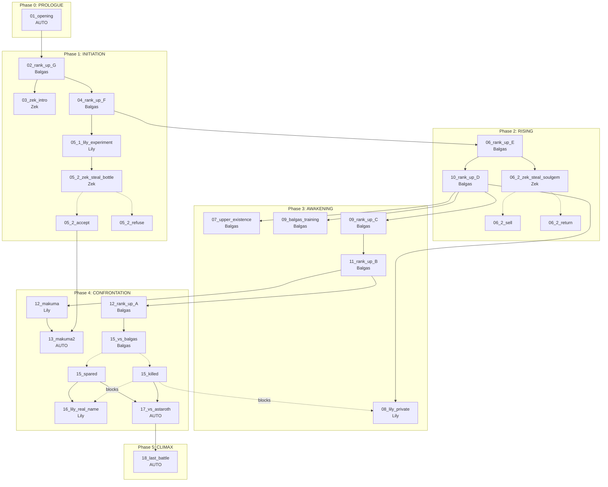

# クエスト依存関係フロー図データ

## クエスト一覧（28クエスト）

### フェーズ別クエスト

```
PROLOGUE (Phase 0)
├── 01_opening [AUTO] → Phase: INITIATION

INITIATION (Phase 1)
├── 02_rank_up_G [Balgas] → Phase: RISING
├── 03_zek_intro [Zek]
├── 04_rank_up_F [Balgas]
├── 05_1_lily_experiment [Lily]
└── 05_2_zek_steal_bottle [Zek] → 分岐
    ├── 05_2_zek_steal_bottle_accept
    └── 05_2_zek_steal_bottle_refuse

RISING (Phase 2)
├── 06_rank_up_E [Balgas]
├── 06_2_zek_steal_soulgem [Zek] → 分岐
│   ├── 06_2_zek_steal_soulgem_sell
│   └── 06_2_zek_steal_soulgem_return
└── 10_rank_up_D [Balgas] → Phase: AWAKENING

AWAKENING (Phase 3)
├── 07_upper_existence [Balgas]
├── 08_lily_private [Lily]
├── 09_balgas_training [Balgas]
├── 09_rank_up_C [Balgas]
└── 11_rank_up_B [Balgas] → Phase: CONFRONTATION

CONFRONTATION (Phase 4)
├── 12_makuma [Lily]
├── 13_makuma2 [AUTO]
├── 12_rank_up_A [Balgas]
├── 15_vs_balgas [Balgas] → 分岐
│   ├── 15_vs_balgas_spared
│   └── 15_vs_balgas_killed
├── 16_lily_real_name [Lily]
└── 17_vs_astaroth [AUTO] → Phase: CLIMAX

CLIMAX (Phase 5)
└── 18_last_battle [AUTO] → 分岐
    ├── RESCUE (脱出)
    ├── INHERIT (継承)
    └── USURP (簒奪)
```

## 依存関係グラフ



## フラグ入出力一覧

### クエスト別フラグ

| クエストID | 入力フラグ（前提条件） | 出力フラグ（完了時設定） |
|-----------|----------------------|------------------------|
| 01_opening | なし | sukutsu_opening_seen=1, rank=UNRANKED |
| 02_rank_up_G | quest_done_01_opening | rank=G, phase=INITIATION |
| 03_zek_intro | quest_done_02_rank_up_G | なし |
| 04_rank_up_F | quest_done_02_rank_up_G | rank=F, phase=RISING |
| 05_1_lily_experiment | quest_done_04_rank_up_F | なし |
| 05_2_zek_steal_bottle_accept | quest_done_05_1 | bottle_choice=SWAPPED |
| 05_2_zek_steal_bottle_refuse | quest_done_05_1 | bottle_choice=REFUSED |
| 06_rank_up_E | quest_done_04_rank_up_F | rank=E |
| 06_2_zek_steal_soulgem_sell | quest_done_06_rank_up_E | kain_soul_choice=SOLD |
| 06_2_zek_steal_soulgem_return | quest_done_06_rank_up_E | kain_soul_choice=RETURNED |
| 10_rank_up_D | quest_done_06_rank_up_E | rank=D, phase=AWAKENING |
| 07_upper_existence | quest_done_10_rank_up_D | なし |
| 08_lily_private | quest_done_10, balgas_killed≠KILLED | なし |
| 09_balgas_training | quest_done_10_rank_up_D | なし |
| 09_rank_up_C | quest_done_10_rank_up_D | rank=C |
| 11_rank_up_B | quest_done_09_rank_up_C | rank=B, phase=CONFRONTATION |
| 12_makuma | quest_done_11_rank_up_B | null_chip_obtained=1 |
| 13_makuma2 | quest_done_12_makuma, bottle_choice=SWAPPED | lily_bottle_confession, kain_soul_confession |
| 12_rank_up_A | quest_done_11_rank_up_B | rank=A |
| 15_vs_balgas_spared | quest_done_12_rank_up_A | balgas_killed=SPARED |
| 15_vs_balgas_killed | quest_done_12_rank_up_A | balgas_killed=KILLED |
| 16_lily_real_name | quest_done_15_spared, lily_hostile≠1 | lily_true_name="Lilishiel" |
| 17_vs_astaroth | quest_done_15_spared OR quest_done_15_killed | phase=CLIMAX, fugitive_status=1 |
| 18_last_battle | quest_done_17_vs_astaroth | ending=(RESCUE/INHERIT/USURP) |

## 主要フラグ定義

### 選択フラグ（分岐用）

| フラグキー | 値 | 説明 |
|-----------|-----|------|
| bottle_choice | REFUSED(0), SWAPPED(1) | ゼクの瓶すり替え |
| kain_soul_choice | RETURNED(0), SOLD(1) | カインの魂の扱い |
| balgas_killed | SPARED(0), KILLED(1) | バルガス戦の結末 |
| lily_bottle_confession | CONFESSED(0), BLAMED_ZEK(1), DENIED(2) | 瓶の告白 |
| kain_soul_confession | CONFESSED(0), LIED(1) | 魂の告白 |
| ending | RESCUE(0), INHERIT(1), USURP(2) | エンディング |

### 状態フラグ

| フラグキー | 型 | 説明 |
|-----------|-----|------|
| player.rank | Enum | 現在のランク (G〜SSS) |
| player.current_phase | Int | ストーリーフェーズ (0-5) |
| player.karma | Int | カルマ値 (-100〜100) |
| player.contribution | Int | 貢献度 (0〜1000) |
| lily_hostile | Bool | リリィ敵対状態 |
| balgas_trust_broken | Bool | バルガス信頼崩壊 |
| fugitive_status | Bool | 逃亡者状態 |

## 分岐ポイント（5箇所）

1. **瓶すり替え** (05_2): accept ⇔ refuse
   - accept → 13_makuma2 有効化
   - refuse → 13_makuma2 無効

2. **カインの魂** (06_2): sell ⇔ return
   - sell → 13_makuma2でカイン対立イベント
   - return → バルガス信頼維持

3. **バルガス戦** (15): spared ⇔ killed
   - spared → 16_lily_real_name 解放
   - killed → 08_lily_private, 16 ブロック

4. **告白選択** (13_makuma2):
   - 瓶: confessed / blamed_zek / denied
   - 魂: confessed / lied
   - → lily_hostile, balgas_trust_broken に影響

5. **エンディング** (18): rescue / inherit / usurp

## クリティカルパス

### 最短ルート（11クエスト）
```
01_opening → 02_rank_up_G → 04_rank_up_F → 06_rank_up_E → 10_rank_up_D
→ 09_rank_up_C → 11_rank_up_B → 12_rank_up_A → 15_vs_balgas
→ 17_vs_astaroth → 18_last_battle
```

### 全コンテンツルート（最大23クエスト）
全28クエスト中、分岐で排他的な5ペアを除く23クエストが1周で体験可能
